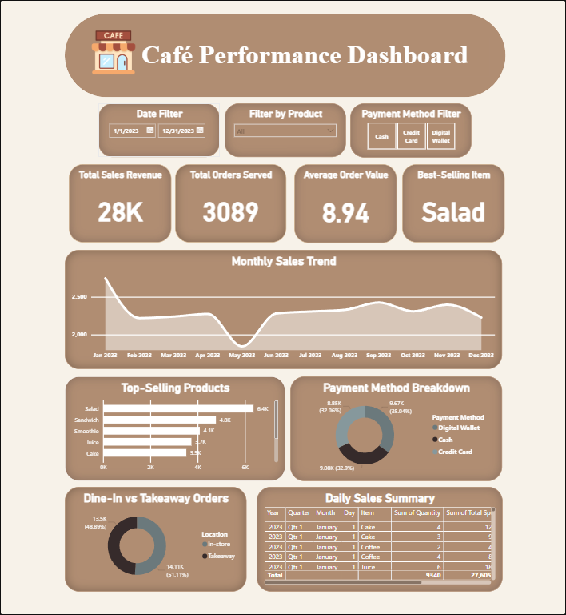

☕ Café Sales Performance Dashboard

This project showcases a Café Sales Performance Dashboard designed to analyze sales trends, customer behavior, and product performance. The dashboard provides insights that help café owners make informed decisions on menu planning, staffing, and daily operations.

📊 Dashboard Overview
Section	Description
Dashboard Title	Café Performance Dashboard
Filters	Store & Menu Filters
Date Filter	Select Date Range
Product Filter	Filter by Product
Payment Method Café Filter

🎯 Key Performance Metrics (KPIs)
KPI	Description
Total Revenue 💰	Overall sales earnings
Total Orders ☕	Count of customer orders
Average Order Value 🧾	Average ₱ spent per order
Top-Selling Item 🥐	Best item based on quantity sold

📈 Visuals Used
Visual	Purpose
Line + Area Chart	Monthly revenue trend
Horizontal Bar Chart	Top-selling menu items
Donut Chart	Payment method breakdown
Dine-in vs Takeaway Pie	Customer order preference
Daily Revenue Table	Daily sales summary

📸 Dashboard Preview

🛠️ Tech Stack
Tool	Use
Power BI	Dashboard & data modeling
Pandas / Python (optional)	Data cleaning and preparation
CSV Dataset	Sales data source

🚀 Features

Interactive date, product, and branch filters

Coffee-themed clean UI design

Insights for menu strategy & customer behavior

Highlighted sales KPIs

📂 Dataset Description
Column	Description
Date	Order date
Branch	Café location
Product	Menu item
Category	Food/Drink
Quantity	Units sold
Price	Unit price
Payment Method	Cash/Card/etc
Order Type	Dine-in / Takeaway
Total	Total bill per order
👨‍💻 How to Use

Load Power BI .pbix file

Import dataset (CSV/XLSX)

Refresh Data

Interact with filters & visuals

📌 Future Improvements

Add customer loyalty insight

Add peak-hour heat map

Integrate live database or POS API

💡 Dashboard Inspiration

Designed with a cozy café theme — warm tones, clean layout, and minimal visuals to highlight data clarity and user experience.

🏆 Purpose

To simulate a real-world business dashboard for cafés, ideal for:

✔ Portfolio Projects
✔ Data Analyst Practice
✔ Power BI Skill Showcase

🙌 Author

Created by Carl John Haro
📍 Data Analyst | Power BI | Databases | Visualization
